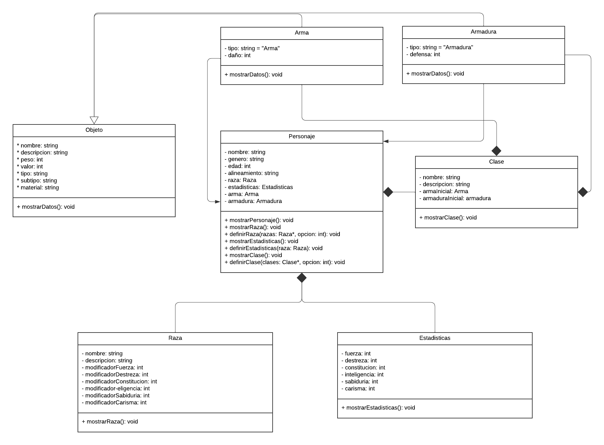

# DnD Charachter creator 🧙‍♂️

## Project description

The objective of this project is to assist DnD enthusiasts in creating their character for the game, helping them to design and define aspects of their character such as alignment, race, stats and class, as well as modifying the stats according to the race they choose and assigning them a weapon and initial armor depending on the class they have chosen.

Likewise, the project has an encyclopedia, in which users can consult the different types of races, classes, weapons and armor present in the game.

## Class diagram

## Execution instructions

To run the program, since C++ is a language that needs to be compiled, it is necessary to have the `gcc` compiler installed. To check if you have it installed, you can execute the following command in the terminal: `gcc --version`. If it is not installed, it can be installed with the following command: `sudo apt install gcc`. Once installed, you can compile the program with the following command: `g++ -o main.exe main.cpp`. Finally, you can run the program with the following command: `./main.exe`.
